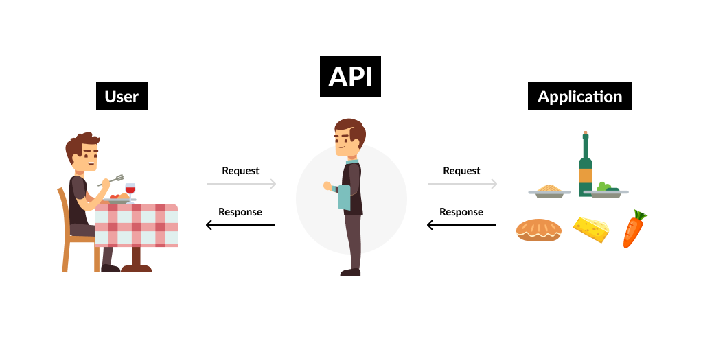
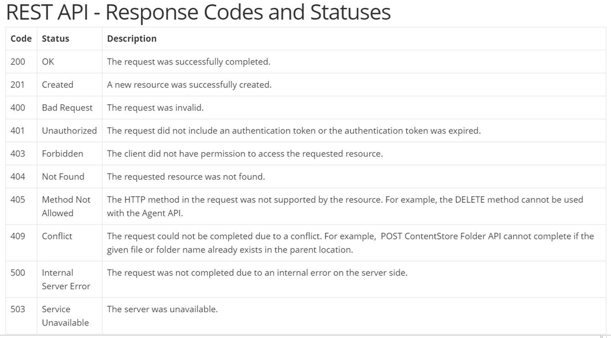

###  API- Application programming interface

Example:

 
#### Request:
- get - retrive from database
- post - create database
- put - update database

#### Respone:
This will be based on the request parameters passed to the server

#### status codes-XXX

